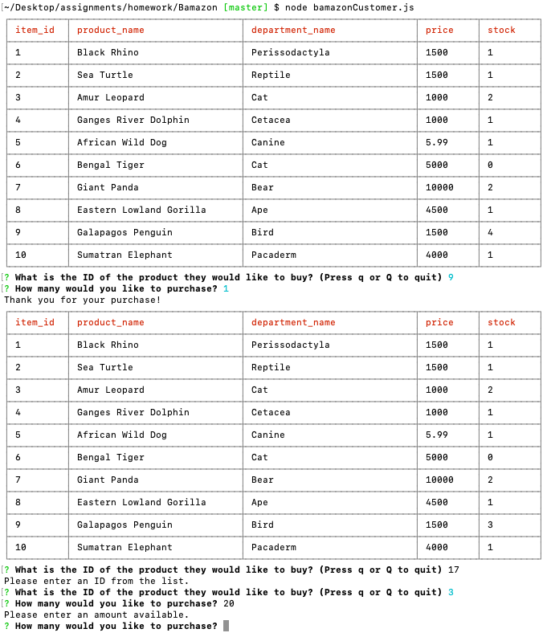

# Bamazon
* Application
    - Provides a list of items available with info
    - Enter id of item you want
        - If you press q or Q you can quit the program
        - If you enter an invalid number it will ask you to enter another option
    - Enter the quantity you want
        - If you enter more than what is in stock it will ask you for another number
        - If you enter a correct amount it will remove the amount from the table and generate the updated list
    -  Have fun!

* Technology used
    - JS
    - mySQL
    - Node.js

* Process
    - Identify the objective
    - Find the tools and methods necessary to fulfill the objective
    - Create the table of data in SQL
    - Link javascript to SQL
    - Create functions to meet objectives
    - Order in a manner which makes sense
    - Test for problems
        - Log areas to look for bugs
    - Write out a solid README.md

### Link to Deployed Page

https://github.com/ctghadiri/Bamazon

### IMAGE of Final Product

### Learning Points
* A solid plan via pseudocoding saves time and energy
* When working with servers placement is key to ensure everything transpires in order
* Establishing a clean and organized javascript 
    - Makes the entire process easier to understand
    - Helps with debugging
* Small changes in code can have significant effects
* Solid Google-Fu is indispensable

### Author

## Cyrus Ghadiri

### Acknowledgments

* UC BERKELEY BOOTCAMP TEAM
* https://www.npmjs.com
    - Inquirer
    - mysql
    - cli-table2